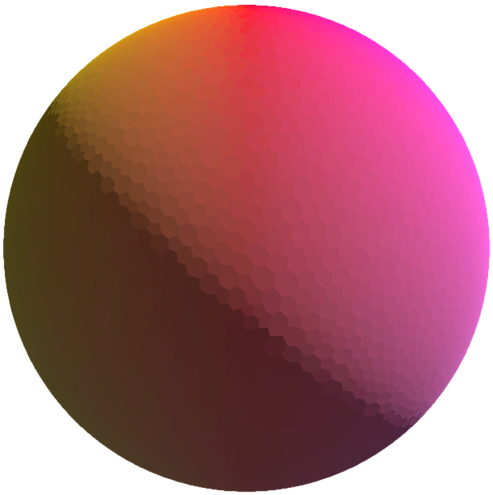

<div align="center">
  
  <br>
  <h1>Planetastic</h1>
</div>

<p align="center">
  <a href="https://github.com/spuddydev/planetastic/actions/workflows/test.yml"></a>
  <a href="https://godotengine.org/"></a>
  <a href="https://github.com/psf/black"></a>
  <a href="LICENSE"></a>
</p>


<p align="center">A procedural planet generator for Godot 4.6.</p>

## Features

- Sphere generation with non-uniform cells via Delaunay/Voronoi tessellation
- Edge perturbation and centroid relaxation for organic-looking regions
- Dual mesh (Voronoi-like) construction from triangle topology

### Planned

- Tectonic elevation simulation
- Precipitation/temperature biome modelling

## Getting Started

### Prerequisites

- [Godot 4.6](https://godotengine.org/) (Forward Plus renderer, Jolt Physics)

### For development

- [gdtoolkit 4.x](https://github.com/Scony/godot-gdscript-toolkit) — linting and formatting
```bash
pipx install "gdtoolkit==4.*"
```
- [pre-commit](https://pre-commit.com/) — automatic lint/format on commit
```bash
pre-commit install
```

### Installation

```bash
git clone https://github.com/spuddydev/planetastic.git
cd planetastic
```

Open the project in Godot 4.6 and run the main scene.

## Testing

Tests use [GUT](https://gut.readthedocs.io/) and live in `tests/`, prefixed with `test_`.

```bash
# Run all tests (headless)
godot --headless -s res://addons/gut/gut_cmdln.gd -gdir=res://tests -ginclude_subdirs -gexit

# Run a single test file
godot --headless -s res://addons/gut/gut_cmdln.gd -gdir=res://tests -gtest=res://tests/unit/test_example.gd -gexit
```

## Project Structure

```
src/
├── planet/       # Planet scene and orchestration
├── sphere/       # Delaunay/Voronoi mesh generation
├── tectonics/    # Plate simulation and boundaries (planned)
├── climate/      # Wind, moisture, biomes (planned)
└── common/       # Shared math and mesh utilities
```

## Contributing

Contributions are welcome. Please open an issue first to discuss what you'd like to change.

## Licence

Distributed under the MIT Licence. See [LICENSE](LICENSE) for details.
